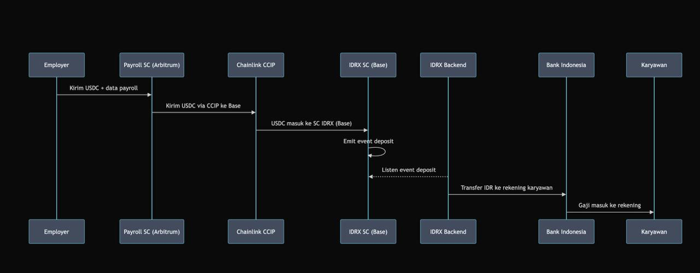

# How We Achieve Cross-border Capability

NusaPay leverages a sophisticated, yet streamlined, architecture to deliver seamless cross-border payroll and payment capabilities. Our process ensures that digital assets are efficiently converted and delivered to local bank accounts, anywhere in the world.

<figure><figcaption>
Sequence Diagram: NusaPay's End-to-End Cross-Border Payroll Flow, from Digital Assets to Employee Bank Account.
</figcaption></figure>

Here’s how we achieve our cross-border capability, designed for clarity and efficiency:

### 1. Initiation by Employer

An employer begins by securely sending digital assets, such as USDC, along with their comprehensive payroll data, to our Payroll Smart Contract (e.g., deployed on Arbitrum). This contract acts as the central orchestrator for the mass payment process.

### 2. Secure Cross-Chain Transfer

To ensure funds are on the optimal blockchain for local currency conversion, our system facilitates secure cross-chain transfers. For instance, the Payroll Smart Contract can leverage powerful interoperability protocols like Chainlink CCIP to move USDC from Arbitrum to another designated chain (e.g., Base). This step is handled seamlessly in the background, abstracting blockchain complexities from the employer.

### 3. Local Currency Conversion & Token Burning

Once the USDC arrives on the target chain, it interacts with our Local Currency Smart Contract (e.g., IDRX SC on Base, where IDRX serves as a digital representation of the Indonesian Rupiah for this example). This smart contract then emits a 'deposit event,' signaling the readiness for conversion and payout.

### 4. Off-Chain Integration for Fiat Payout

Our Local Currency Backend/API continuously listens for these 'deposit events.' Upon detection, it triggers the final crucial step: initiating a transfer of the corresponding local fiat currency (e.g., IDR) directly to the employee's bank account via local banking rails (e.g., Bank Indonesia).

### 5. Direct Bank Deposit

The entire process culminates with the salary being securely deposited into the Employee's Bank account.

This integrated flow ensures that employers can initiate international payroll efficiently with digital assets, while employees receive their salaries directly in their local bank accounts, bridging the gap between blockchain and traditional finance for global remuneration. Our architecture is designed to be extensible, supporting various local currency representations and banking integrations to scale our cross-border reach.
